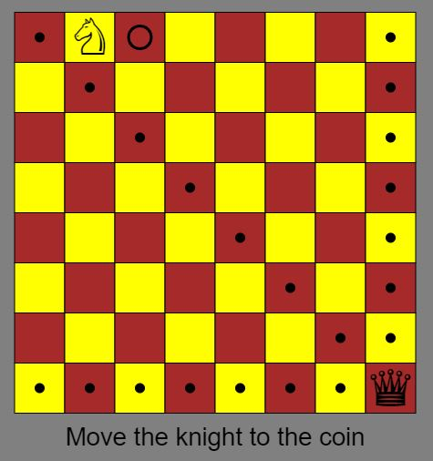

# Knight Moves

Spelet går ut på att med en springare besöka alla rutor på ett schackbräde.  
Dock måste man undvika att bli slagen av en dam.  

Man inleder med att ange var damen ska stå.

Därefter klickar man på de rutor springaren ska gå till.

Ett mynt ligger på den ruta man ska gå till.

Dam på gul ruta markerar EJ vilka rutor damen hotar.

[Inspiration](https://www.funnyhowtheknightmoves.com/)

[Github](https://github.com/jairtrejo/knight-moves)

[Shortest Path](https://gist.github.com/hughdbrown/5c14ec41c30532807afaeba9c16789a8)

[Hacker News](https://news.ycombinator.com/item?id=34460868)