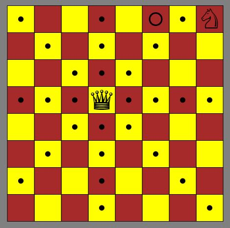

# Knight Moves

[Try it!](https://christernilsson.github.io/2023-008-KnightMoves/)

Spelet går ut på att med en springare besöka alla rutor på ett schackbräde.  
Dock måste man undvika att bli slagen av en dam.  

Man inleder med att ange var damen ska stå.

Därefter klickar man på de rutor springaren ska gå till.

Ett mynt markerar vilken ruta man ska gå till.

Dam på GUL ruta markerar vilka rutor damen hotar (lättare)

Dam på RÖD ruta markerar EJ vilka rutor damen hotar (svårare)

Qd5 kräver 158 drag.

[Inspiration](https://www.funnyhowtheknightmoves.com/)

[Shortest Path](https://gist.github.com/hughdbrown/5c14ec41c30532807afaeba9c16789a8?permalink_comment_id=4451216#gistcomment-4451216)

[Github](https://github.com/jairtrejo/knight-moves)

[Hacker News](https://news.ycombinator.com/item?id=34460868)

[Lösningar](knight.txt) (ruta, antal steg, steg)
